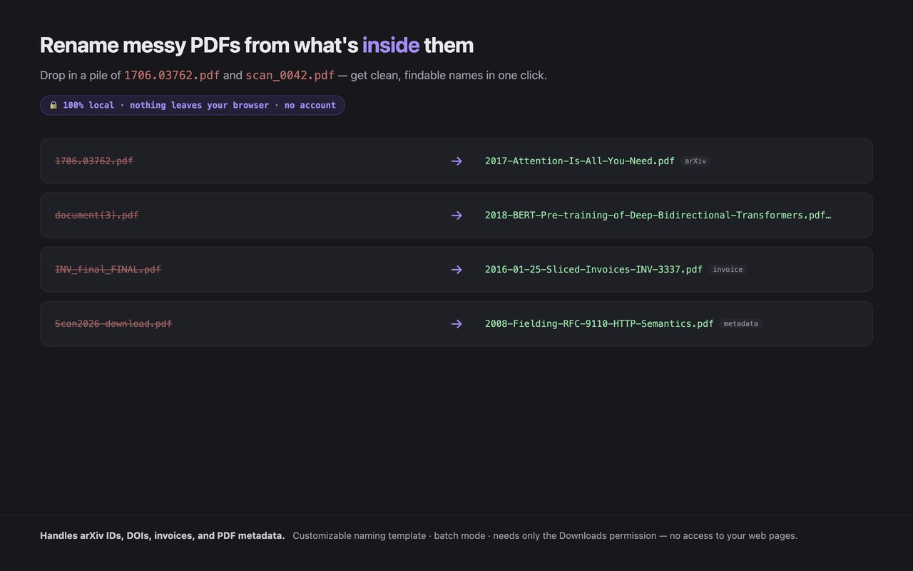

# PDF Smart Rename

Your downloads folder has `1706.03762v7.pdf`, `sdarticle.pdf`, `download (3).pdf`, and
`ijsdoc_20250114_final_v2.pdf` in it. Every one of them has a real title printed on its first page.
None of that title is in the filename, so finding a paper again means opening four PDFs.

## What happens when you install this one

Drop a pile of PDFs into the extension and it reads each one, then proposes a name built from what is
inside the file:

```
1706.03762v7.pdf   ->   2017-Attention-Is-All-You-Need.pdf
sdarticle.pdf      ->   2016-01-25-Sliced-Invoices-invoice-INV-3337.pdf
```

Every suggestion is editable before anything is written. Save one, or apply the whole batch.

Where the name comes from, in order of preference: the PDF's own Title metadata (with wrappers like
`Microsoft Word - x.docx` stripped off and junk titles rejected), then the largest-type heading on
page one (lines are clustered by vertical position, so a title split across two lines comes back
whole), then a structured identifier, then a date.

Structured identifiers it recognises: arXiv IDs in both the new and old style, DOIs, ISBNs, invoice
numbers, and dates. Academic PDFs come out as title plus first author plus year; invoices come out as
vendor plus date plus invoice number. The template is yours to change:
`{title} {author} {year} {date} {id} {vendor} {type} {original}`, with empty tokens folding away along
with their separators.

Measured on seven real PDFs, the primary identifier was correct on all six that had extractable text
or metadata, and type classification was correct on all seven.



## What it does not do

Two limits worth knowing before you install:

- **Scanned, image-only PDFs have no text layer**, so there is nothing to extract and the name falls
  back to a date. Adding OCR would mean a much heavier extension, which is a trade this one does not
  make.
- **Chrome does not let an extension rename an arbitrary file on your disk.** "Apply" saves a copy
  under the new name into your downloads folder with `conflictAction: uniquify`, and leaves the
  original where it was.

Also, CJK text in PDFs using CID fonts may extract incompletely, because cMaps are not bundled. Latin
text is unaffected.

## Privacy

Your PDFs stay on your machine. There is no server behind this extension, no upload, no OCR service,
and no network request of any kind. PDF.js and its worker are bundled locally rather than pulled from
a CDN, `getDocument` is handed an in-memory buffer, and `disableAutoFetch` and `disableStream` are set
with no `cMapUrl` or `standardFontDataUrl`, so runtime network traffic is zero. Grep `extension/` for
`fetch`, `XMLHttpRequest`, `sendBeacon` and `WebSocket` and the only hits are inside the bundled
PDF.js itself, on paths this extension does not use.

Every permission, and why it is there. There are two, and no host permissions:

- **`downloads`**: the only way an extension can write a renamed file at all. See the limit above.
- **`storage`**: your filename template and separator choices, kept locally.

Full privacy policy: <https://minty-modesty.github.io/pdf-smart-rename-extension/privacy.html>

## Install

Chrome Web Store: <https://chromewebstore.google.com/detail/aihfigofjhloklmkibkbjpflhohmdpik>

From source:

```
git clone https://github.com/minty-modesty/pdf-smart-rename-extension.git
```

Open `chrome://extensions`, switch on Developer mode, choose **Load unpacked**, and select the
`extension/` folder. For batches, click the "⤢ Tab" link in the popup: a full tab survives the native
file dialog, and on some platforms a popup does not.

## Notes

MIT licensed. Bundles Mozilla's PDF.js under Apache-2.0; see `NOTICE`. The naming heuristics in
`extension/rename.js` are pure functions with no I/O, shared between the browser and the Node tests in
`test/`. Issues and pull requests get read and answered as time allows, which is not a support
commitment.
